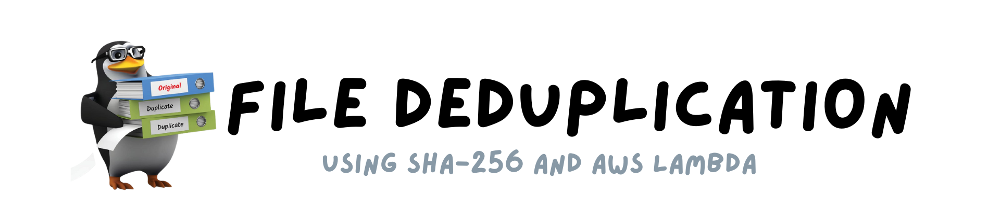
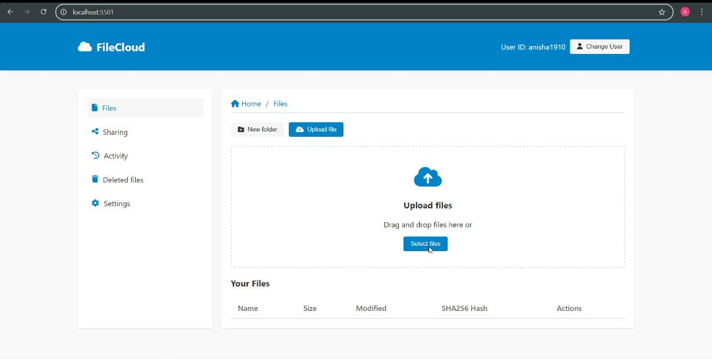
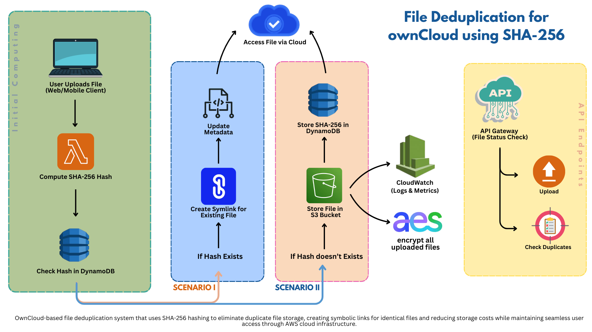

# FileCloud - Deduplication System

FileCloud is a file storage and management system with built-in deduplication using SHA256 checksums. This project consists of a FastAPI middleware, frontend interface, and Node.js server.


<!-- Add your logo screenshot here -->

## Features

- ✅ File upload with drag-and-drop interface
- ✅ SHA256-based file deduplication
- ✅ AWS S3 integration for storage
- ✅ RESTful API middleware
- ✅ Modern OwnCloud-like UI
- ✅ Progress tracking for uploads
- ✅ User-based file management

## Screenshots

### Frontend
<p align="center">
  
</p>
<!-- Add your dashboard screenshot here -->

## Architecture

The project consists of three main components:

1. **FastAPI Middleware**: Handles file processing, deduplication, and AWS S3 interactions
2. **Frontend UI**: OwnCloud-like interface for users to interact with the system
3. **Node.js Server**: Serves the frontend assets

<p align="center">
  
</p>

<!-- Add your architecture diagram here -->

## Installation & Setup

### Prerequisites

- Python 3.8+
- Node.js 14+
- AWS Account with S3 bucket configured
- AWS Lambda (optional for additional processing)

### 1. FastAPI Middleware Setup

```bash
# Clone the repository
git clone https://github.com/yourusername/filecloud.git
cd filecloud/middleware

# Create virtual environment
python -m venv venv
source venv/bin/activate  # On Windows: venv\Scripts\activate

# Install dependencies
pip install fastapi uvicorn python-dotenv requests

# Create .env file
echo "UPLOAD_API=https://your-aws-lambda-url.amazonaws.com/upload" > .env

# Run the server
uvicorn main:app --reload --port 8000
```

### 2. Frontend Setup

```bash
# Navigate to frontend directory
cd ../frontend

# Install dependencies
npm install

# Run the development server
node server.js
```

The frontend will be available at `http://localhost:5501`.

### 3. Configuration

Create a `.env` file in the middleware directory with the following:

```
UPLOAD_API=https://your-aws-lambda-url.amazonaws.com/upload
```

## API Endpoints

### File Upload

```
POST /owncloud-upload?userID={userID}
```

**Parameters:**
- `userID`: User identifier for file ownership

**Request Body:**
- Form data with `file` field containing the file to upload

**Response:**
```json
{
  "fileName": "example.jpg",
  "fileHash": "8f7d88e901a5ad3a05d8cc0de93313fd76028f076ccd1d416cbf0fdb3e1c10fe",
  "s3Key": "user123/example.jpg",
  "deduplicated": false
}
```

## Detailed Documentation

For more detailed documentation, please visit our [GitBook](https://tejass-organization-5.gitbook.io/deduper).

The documentation includes:
- Complete API reference
- AWS setup guide
- Advanced configuration options
- Performance optimization tips
- Security best practices

## Development

### Running Tests

```bash
# For middleware tests
cd middleware
pytest

# For frontend tests
cd frontend
npm test
```

### Building for Production

```bash
# Build frontend
cd frontend
npm run build

# Deploy middleware
cd middleware
# Follow deployment steps for your hosting platform
```

## Contributing

1. Fork the repository
2. Create your feature branch (`git checkout -b feature/amazing-feature`)
3. Commit your changes (`git commit -m 'Add some amazing feature'`)
4. Push to the branch (`git push origin feature/amazing-feature`)
5. Open a Pull Request

## Collaborators

- [Anisha Shankar](https://github.com/hahaanisha)
- [Tejas Gadge ](https://github.com/tejasgadge2504)
